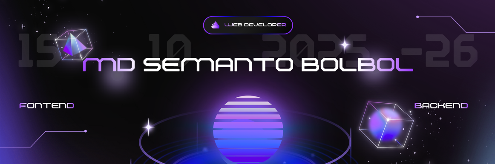

# 
 👋 Assalamu-alaikum, I'm ***MD SEMANTO BOLBOL*** 

### 
🚀 About Me

I'm a passionate ***Learner*** with a strong interest in ***Software Development***. I love building scalable, efficient, and user-friendly solutions. Currently exploring ***Next.js***.

- 🔭 I’m currently working on ***Halaliat Shop***
- 🌱 I’m currently learning ***React***
- 👯 I’m looking to collaborate on **[open-source projects/ideas]**
- 💬 Ask me about ***HTML5, CSS, JavaScript, TypScript,React***
- 📫 How to reach me: **seman2.1206@proton.me**
- ⚡ Fun fact: ***Life has no undo button and death has no restart!***
 

  <h2 style="color: white; margin: 0;">
    
    &nbsp;Tech Stack&nbsp;
    
  </h2>

  <table>
  <tr>
    <td align="center" valign="middle" width="35%">
      <h3>💻 Programming Languages</h3>
    </td>
    <td align="center" valign="middle" width="65%">
      
    </td>
  </tr>

  <tr>
    <td align="center" valign="middle">
      <h3>🌐 Web Development</h3>
    </td>
    <td align="center" valign="middle">
      
    </td>
  </tr>

  <tr>
    <td align="center" valign="middle">
      <h3>🗄️ Databases</h3>
    </td>
    <td align="center" valign="middle">
      
    </td>
  </tr>

  <tr>
    <td align="center" valign="middle">
      <h3>☁️ Cloud & DevOps</h3>
    </td>
    <td align="center" valign="middle">
      
    </td>
  </tr>

  <tr>
    <td align="center" valign="middle">
      <h3>⚙️ Tools & Platforms</h3>
    </td>
    <td align="center" valign="middle">
      
    </td>
  </tr>
  </table>

  

# 
My Top Projects

### [EggSell Shop](https://github.com/seman2-Dev/eggsell_shop)

**Description:** A modern static egg-selling website that allows customers to view live stock, select egg quantities, calculate prices, provide delivery information, choose payment methods, and place orders directly through WhatsApp. Includes an interactive 3D egg display and an admin panel for stock and sales management.

**Tech Stack:** `HTML5` `CSS3` `JavaScript` `Three.js` `LocalStorage`

**Highlights:**
- Built an interactive 3D egg and tray display using Three.js.
- Implemented real-time stock, sold, and available quantity updates.
- Added dynamic price calculation with quantity and delivery charges.
- Integrated Cash on Delivery, bKash, and Nagad payment options.
- Implemented WhatsApp order integration for direct customer orders.
- Added admin panel for stock and sales management.
- Used LocalStorage for persistent stock and sales data.
- Designed a responsive mobile-friendly interface.

### [LMS-Learning Management System](https://github.com/seman2-Dev/lms_learning-managment-system)

**Description:** Full-stack Learning Management System designed to streamline academic management by connecting administrators, teachers, and students through centralized tools for attendance, examinations, results, syllabus, notices, complaints, documents, and communication.

**Tech Stack:** `HTML5` `Tailwind CSS` `React.js` `Node.js` `Express.js` `JavaScript`

**Highlights:**
- Built REST APIs for teacher and student management, attendance tracking, examination results, CGPA, notices, syllabus, complaints, and teacher ratings.
- Implemented separate academic workflows for administrators, teachers, and students, including performance tracking and course management.
- Added communication features with teacher-student chat and notification hooks for attendance, examination results, and live classes.

  

  

<table>
  <tr>
    <td align="center">
      
    </td>
    <td align="center">
    
    </td>
    <td align="center">
    
    </td>
  </tr>
</table>

  

 

 

  

